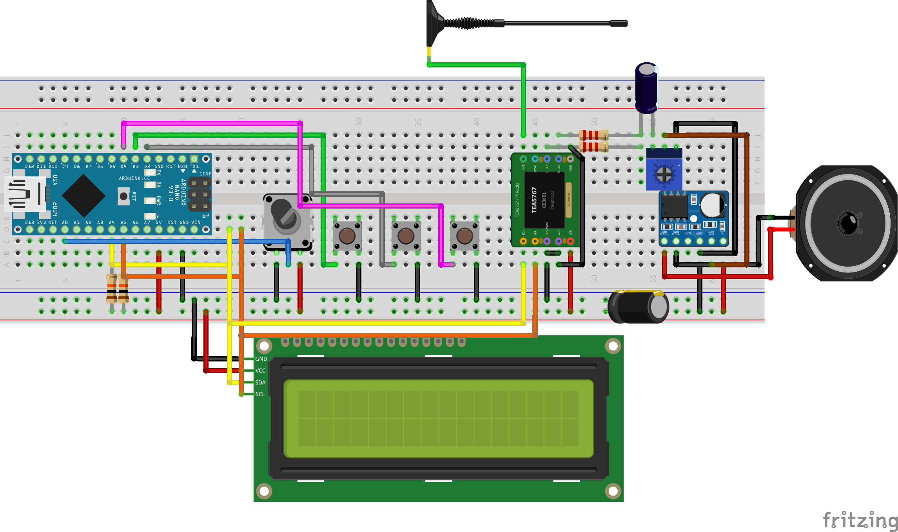

# Arduino Nano FM Radio Receiver (TEA5767)

A robust, highly optimized FM radio receiver built with an Arduino Nano, a TEA5767 module, and an LTK5128 Class-AB audio amplifier. This project is specifically designed to minimize Electromagnetic Interference (EMI) and provide clean, stable audio using standard breadboard components.

## ✨ Key Features

* **Advanced Noise Reduction:** The TEA5767 is programmatically configured with Stereo Noise Canceling (SNC), High Cut Control (HCC), and Soft Mute to filter weak signals.
* **Zero-EMI Amplification:** Utilizes the LTK5128 Class-AB mono amplifier instead of standard Class-D modules (like the PAM8403) to prevent high-frequency switching noise from drowning out the RF antenna.
* **Safe Mono Summing:** Implements a passive resistor-capacitor network to safely blend the TEA5767's stereo output into mono while blocking DC offset.
* **Optimized Firmware:** Non-blocking `millis()` logic for I2C cooldowns, button debouncing, and custom LCD scanning animations.
* **Dual Tuning Modes:** Features an Auto-Scan mode that saves found stations, and a Manual mode (0.1MHz Coarse / 0.01MHz Fine) controlled via potentiometer.

## 🛠️ Hardware Requirements

* 1x Arduino Nano (ATmega328P)
* 1x TEA5767 FM Radio Module
* 1x LTK5128 Mini Class-AB Audio Amplifier
* 1x 16x2 LCD with I2C Backpack
* 3x Push Buttons (Mode, Action, Lock)
* 2x 10kΩ Resistors (I2C Pull-ups)
* 2x 2.2kΩ Resistors (Mono Summing Buffer)
* 1x 10µF Electrolytic Capacitor (DC Blocking)
* 1x 10kΩ Potentiometer (Volume Control)
* 1x 10kΩ Potentiometer (Manual Tuning)
* 1x 4Ω or 8Ω Speaker 

## 🔌 Circuit & Wiring Notes

**Important Hardware Engineering Notes:**
1. **Logic Levels:** The entire circuit, including the TEA5767 and LTK5128, is powered directly from the 5V rail. Pull-up resistors on SDA/SCL are tied to 5V to match the Arduino Nano's logic level.
2. **I2C Stability:** The TEA5767's `BUS Mode` and `W/R` pins are hardwired to GND to prevent addressing conflicts and environmental noise.
3. **Power Limit:** When powering via USB through the Arduino Nano, keep the amplifier volume moderate. The Nano's internal USB diode is rated for 500mA, and maxing out the 5W amplifier may exceed this limit.

## 💻 Software Dependencies

Install the following libraries via the Arduino Library Manager:
* [TEA5767 Radio Library](https://github.com/mroger/TEA5767) (by Marcos Rogerio)
* [LiquidCrystal_I2C](https://github.com/johnrickman/LiquidCrystal_I2C)

## 🕹️ Controls

* **Mode Button (D3):** Toggles between Auto-Scan mode and Manual Tuning mode.
* **Action Button (D2):** * *In Auto Mode:* Cycles to the next saved station.
  * *In Manual Mode:* Toggles between Coarse (0.1MHz) and Fine (0.01MHz) tuning.
* **Lock Button (D4):** Freezes the current frequency in Manual mode to prevent accidental potentiometer bumps.
* **Tuning Knob (A0):** Adjusts the frequency when in Manual mode.

## 🚀 Installation & Setup

1. Assemble the hardware according to the schematic.
2. Connect the Arduino Nano to your PC via USB.
3. Open the `.ino` file in the Arduino IDE.
4. Verify you have the required libraries installed.
5. Compile and upload to the Nano.
6. The radio will automatically perform a band scan on first boot.